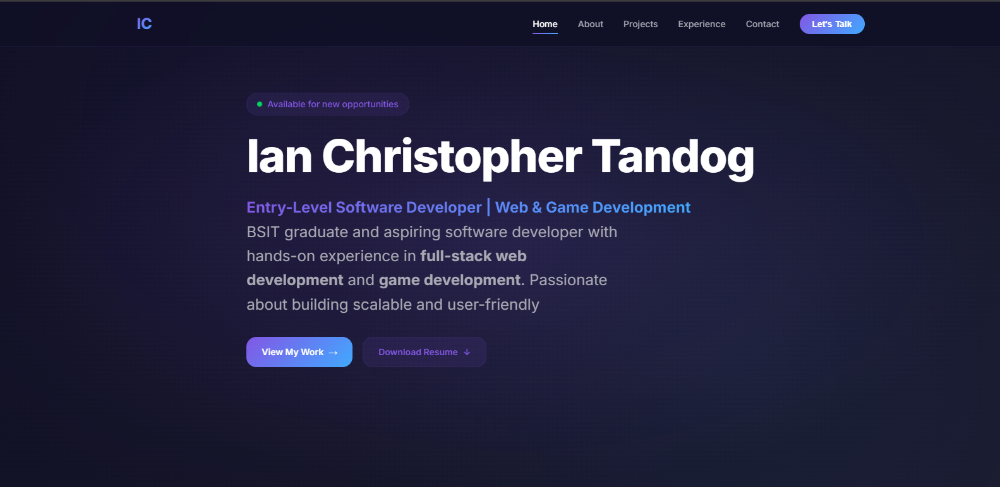

# Portfolio Website

A modern, responsive portfolio website showcasing my projects and skills as a web developer.

## 🚀 Live Demo
[View Portfolio](https://ictandog-portfolio.vercel.app/)

## 🛠️ Tech Stack
- HTML5 & Semantic Markup
- CSS3 with Custom Properties (CSS Variables)
- Vanilla JavaScript (ES6+)
- Responsive Design (Mobile-First)

## 📱 Features
- Fully responsive design (Mobile, Tablet, Desktop)
- Smooth scroll animations and hover effects
- Mobile hamburger menu with smooth transitions
- Back-to-top functionality
- Contact form integration
- Clean, modern UI with dark theme
- Optimized performance and accessibility
- EmailJS integration
- Calendy integration

## 🖼️ Screenshots
